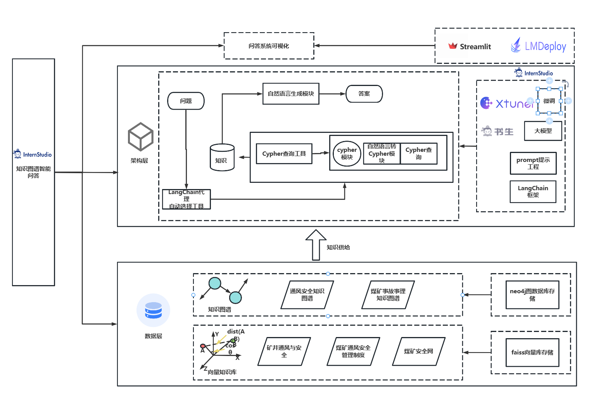

# 基于书生大模型的知识图谱问答项目

开源不易，如果本项目帮到大家，可以右上角帮我点个 star~ ⭐

您的 star ⭐ 是我们最大的鼓励，欢迎 Star⭐、PR 和 Issue。

## 📖 目录

- [基于书生大模型的知识图谱问答项目](#基于书生大模型的知识图谱问答项目)
  - [📖 目录](#-目录)
  - [🔄 架构图](#-架构图)
  - [📝 简介](#-简介)
  - [运行](#运行)
  - [💕 致谢](#-致谢)
    - [项目成员](#项目成员)
    - [特别鸣谢](#特别鸣谢)

## 🔄 架构图

## 📝 简介

在本项目开展之前已经测试了许多开源 LLM 模型生成 Cypher 语句的能力。部分模型对 Cypher 语法有基本的了解。如 GPT-3.5, 文心一言, 有一些模型生成能力比较弱如 GLM3。之前面临了一些问题：开源模型本地部署既需要超长的上下文又需要很好的生成 Cypher 语句能力。闭源模型接口调用的成本过高。

但是，我没有找到任何模型能够根据提供的示例或图谱架构可靠地生成 Cypher 语句。因此，最好的解决方案是微调开源 LLM 模型以可靠地生成 Cypher 语句。

书生大模型提供了算力平台，同时提供了一些开源，故本项目使用书生大模型及相关的体系来构建一个知识图谱问答系统。

2024/12/30 连接通了 neo4j 数据库， 加装了 APOC ，可以使用 llm 生成一些简单的 cypher 语句进行查询。

2025/01/03 测试了使用 lmdeploy 进行部署，但是支持的工具形式不同 部分大佬有相同问题<https://github.com/InternLM/lmdeploy/issues/3058#issuecomment-2606852164> 所以决定用vllm进行部署。

2025/02/03 开了第二个任务KBQG 新增了一个文件夹，主要用于生成问答数据集。

## 运行

服务器部署

`python -m vllm.entrypoints.openai.api_server \
    --model models/internlm2_5-7b-chat \
    --trust-remote-code \
    --enable-auto-tool-choice \
    --tool-call-parser internlm \
    --chat-template examples/tool_chat_template_internlm2_tool.jinja`

`python -m vllm.entrypoints.openai.api_server \
    --model model/internlm2_5-20b-chat \
    --trust-remote-code \
    --enable-auto-tool-choice \
    --tool-call-parser internlm \
    --chat-template examples/tool_chat_template_internlm2_tool.jinja`

## 💕 致谢

### 项目成员

3MPT 2807213137@qq.com

### 特别鸣谢

**_感谢上海人工智能实验室组织的 书生·浦语实战营 学习活动~_**

**_感谢 OpenXLab 对项目部署的算力支持~_**

**_感谢 浦语小助手 对项目的支持~_**

**_感谢上海人工智能实验室推出的书生·浦语大模型实战营，为我们的项目提供宝贵的技术指导和强大的算力支持！_**
